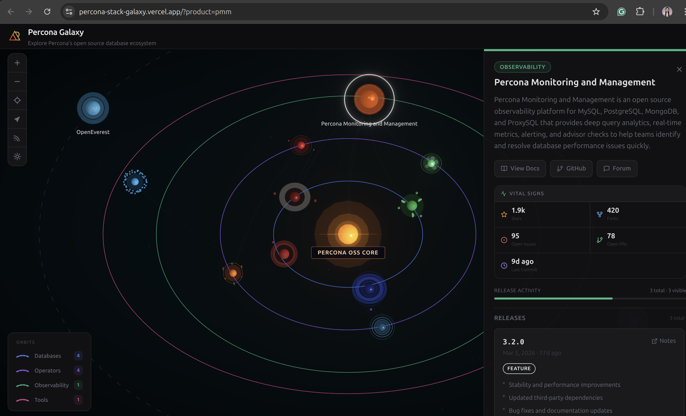

# 🌌 Percona Stack Galaxy

An interactive **3D galaxy map** of Percona's open source database ecosystem.
Navigate a star field, click planets to explore product releases, and see how
tools relate to each other, all driven by live GitHub release data.

> Website: **[percona-stack-galaxy.vercel.app](https://percona-stack-galaxy.vercel.app/)**

 

---

## Features

| Feature | Details |
|---|---|
| 🪐 **3D Galaxy** | react-three-fiber + drei, orbit/pan/zoom controls |
| 🌟 **11 Products** | All Percona DB servers, operators, PMM, Valkey, Toolkit |
| 🔗 **Relationship Edges** | Curved glowing lines: monitors, manages, toolsFor, accelerates |
| 📦 **Release Cards** | Version, date, tags (security/breaking/feature/fix), 3 highlights |
| 🔭 **Filters** | Time window · release tags · product category |
| 🤖 **Automated Pipeline** | GitHub Actions fetches releases daily; no manual maintenance |
| ✨ **Post-processing** | Bloom + Vignette for cinematic galaxy feel |

---

## Quick Start

```bash
git clone https://github.com/your-org/percona-stack-galaxy.git
cd percona-stack-galaxy

npm install
npm run dev          # → http://localhost:3000
```

The app ships a seeded `public/galaxy-data.json` so it works immediately.
To pull fresh data from GitHub:

```bash
# Optional: set a GitHub token
cp .env.example .env
# edit .env and add GITHUB_TOKEN=ghp_...

npm run build:data
```

---

## How the Data Pipeline Works

```
data/products.yaml
      │
      ▼
scripts/build-galaxy-data.ts
      │  reads YAML
      │  fetches GitHub releases for each product
      │  extracts tags via heuristics (security/breaking/feature/fix)
      │  extracts 3 highlight bullets from release body
      │  falls back to seed data if GitHub fetch fails
      ▼
public/galaxy-data.json   ← loaded by the UI at runtime
```

GitHub Actions runs `npm run build:data` daily at 02:00 UTC and
commits any changed `galaxy-data.json` back to the repo.

### Optional AI summarisation

Set `AI_SUMMARIZE=true` and provide `ANTHROPIC_API_KEY` to use
Claude Haiku to generate richer release highlights when the
heuristic extractor finds fewer than 3 bullet points.
AI is **disabled by default** and never required to run the app.

---


## Adding a New Product

1. **Edit `data/products.yaml`**, add an entry following the existing schema:

```yaml
- id: my-product
  name: My Product
  shortName: MP
  category: database          # database | operator | observability | cache | tools
  description: "Short description."
  docsUrl: "https://docs.example.com/"
  github:
    repo: "org/repo-name"
    releasesUrl: ""           # leave blank to use default releases API
  position: { x: 5, y: 0, z: 4 }   # choose a position that doesn't overlap
```

2. **Add edges** (optional) to the `edges:` section using any existing product `id` as `from`/`to`.

3. **Regenerate data:**

```bash
npm run build:data
```

4. Open a PR — the GitHub Action will keep the data current automatically.

---

## Tech Stack

| Layer | Technology |
|---|---|
| Framework | Next.js 15 (App Router) + TypeScript |
| Styling | Tailwind CSS |
| 3D | react-three-fiber + @react-three/drei |
| Post-processing | @react-three/postprocessing (Bloom, Vignette) |
| Data | products.yaml → galaxy-data.json |
| Pipeline | Node.js + tsx (no bundler needed) |
| CI | GitHub Actions (daily scheduled workflow) |

---

## Environment Variables

| Variable | Required | Description |
|---|---|---|
| `GITHUB_TOKEN` | No | Personal Access Token (no scopes needed). Increases rate limit to 5 000 req/h. |
| `AI_SUMMARIZE` | No | Set to `true` to enable AI highlight generation (default: `false`). |
| `ANTHROPIC_API_KEY` | Only if `AI_SUMMARIZE=true` | Anthropic API key for Claude Haiku. |

---

## Contributing

See [CONTRIBUTING.md](CONTRIBUTING.md) for the full guide.

Short version:
1. Fork the repo
2. Create a feature branch: `git checkout -b feat/my-thing`
3. Make your changes + run `npm run lint`
4. Open a PR with a clear description

---

## License

[Apache 2.0](LICENSE), Percona open source community project.
